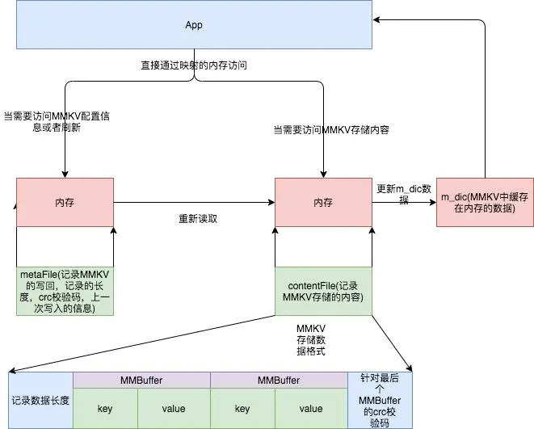
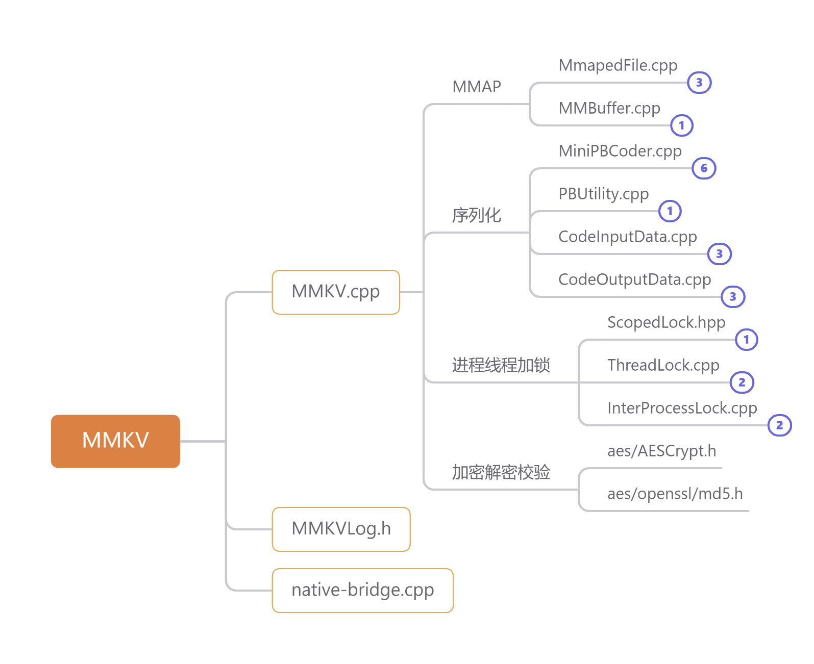

# [MMKV](https://github.com/Tencent/MMKV)
## MMKV 原理
以下的代码实现都可以在MMKV.cpp中看到，其实我们通过对比SharePreference知道，简单数据KV的持久化可简单为put,get
### 内存准备
通过 mmap 内存映射文件，提供一段可供随时写入的内存块，App 只管往里面写数据，由操作系统负责将内存回写到文件，不必担心 crash 导致数据丢失。
### 数据组织
数据序列化方面我们选用 protobuf 协议，pb 在性能和空间占用上都有不错的表现。
### 写入优化
考虑到主要使用场景是频繁地进行写入更新，我们需要有增量更新的能力。我们考虑将增量 kv 对象序列化后，append 到内存末尾。

标准 protobuf 不提供增量更新的能力，每次写入都必须全量写入。考虑到主要使用场景是频繁地进行写入更新，我们需要有增量更新的能力：将增量 kv 对象序列化后，直接 append 到内存末尾；这样同一个 key 会有新旧若干份数据，最新的数据在最后；那么只需在程序启动第一次打开 mmkv 时，不断用后读入的 value 替换之前的值，就可以保证数据是最新有效的。

### 空间增长
使用 append 实现增量更新带来了一个新的问题，就是不断 append 的话，文件大小会增长得不可控。例如同一个 key 不断更新的话，是可能耗尽几百 M 甚至上 G 空间，而事实上整个 kv 文件就这一个 key，不到 1k 空间就存得下。这明显是不可取的。我们需要在性能和空间上做个折中：以内存 pagesize 为单位申请空间，在空间用尽之前都是 append 模式；当 append 到文件末尾时，进行文件重整、key 排重，尝试序列化保存排重结果；排重后空间还是不够用的话，将文件扩大一倍，直到空间足够。

## 整体设计

protobuf协议在CodeInputData读取，CodeOutputData写入的对称关系

	void CodedOutputData::writeString(const string &value) {
	    //先写了大小
	    size_t numberOfBytes = value.size();
	    //writeRawVarint32这个方法position已经增加
	    this->writeRawVarint32((int32_t) numberOfBytes);
	    //再保存值
	    memcpy(m_ptr + m_position, ((uint8_t *) value.data()), numberOfBytes);
	    m_position += numberOfBytes;
	}
	
	void CodedOutputData::writeData(const MMBuffer &value) {
	    //先写了大小
	    this->writeRawVarint32((int32_t) value.length());
	    //再保存值
	    this->writeRawData(value);
	}

	string CodedInputData::readString() {
	    //读取了大小，readRawVarint32这个方法m_position已经增加
	    int32_t size = this->readRawVarint32();
	    if (size <= (m_size - m_position) && size > 0) {
	        //再读值
	        string result((char *) (m_ptr + m_position), size);
	        m_position += size;
	        return result;
	    } else if (size == 0) {
	        return "";
	    } else {
	        MMKVError("Invalid Size: %d", size);
	        return "";
	    }
	}
	
	MMBuffer CodedInputData::readData() {
	    //读取了大小
	    int32_t size = this->readRawVarint32();
	    if (size < 0) {
	        MMKVError("InvalidProtocolBuffer negativeSize");
	        return MMBuffer(0);
	    }
	
	    if (size <= m_size - m_position) {
	        //再读取值
	        MMBuffer data(((int8_t *) m_ptr) + m_position, size);
	        m_position += size;
	        return data;
	    } else {
	        MMKVError("InvalidProtocolBuffer truncatedMessage");
	        return MMBuffer(0);
	    }
	}
### 类图分析

1.mmap和匿名共享内存的有高低版本的支持两个demo

2.具体源码已经在加在代码中,可从get,set作为入口分析。
